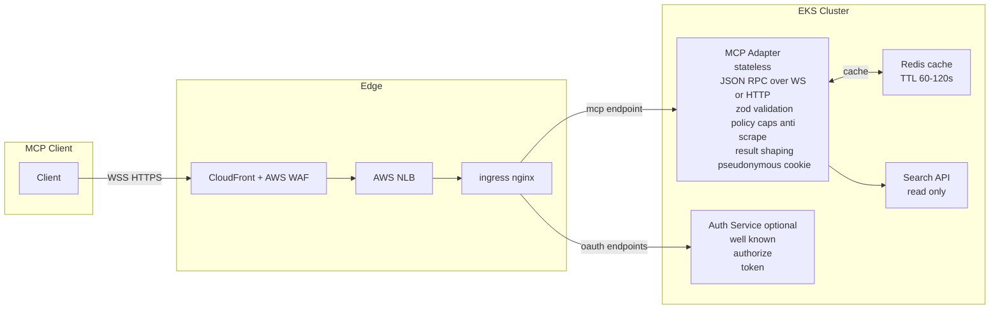
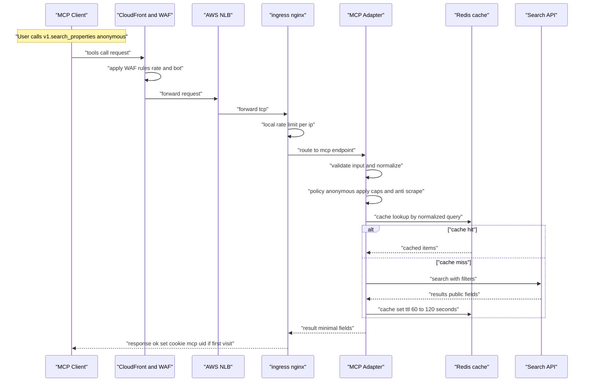
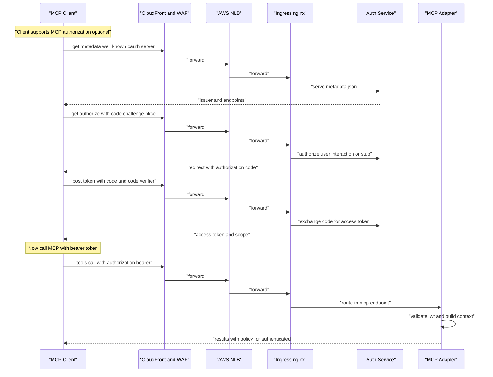
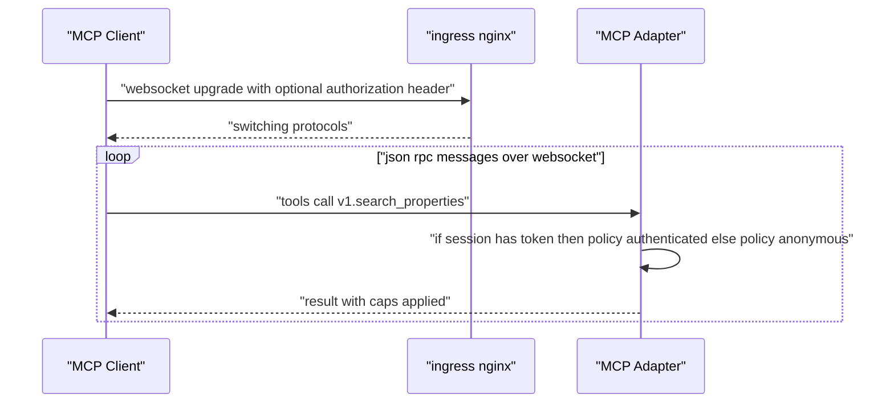
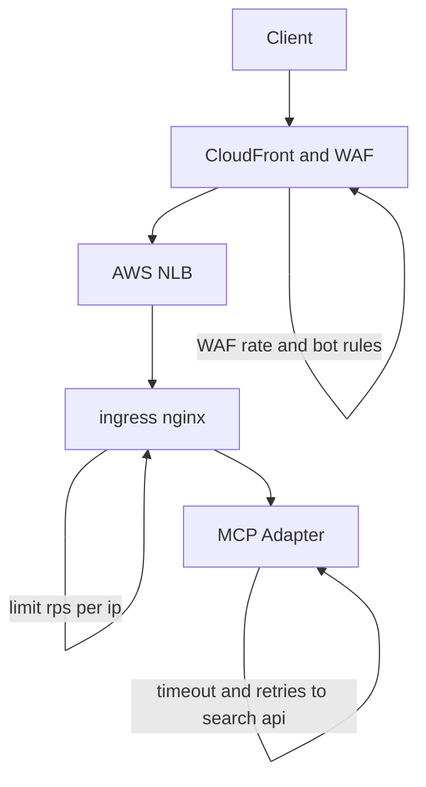

# Http MCP

## Components (EKS + CloudFront/WAF + NLB + ingress-nginx)

## Anonymous search flow

## Optional authorization flow for MCP OAuth with PKCE

## WebSocket upgrade and per message policy

## Error and abuse control decision points

