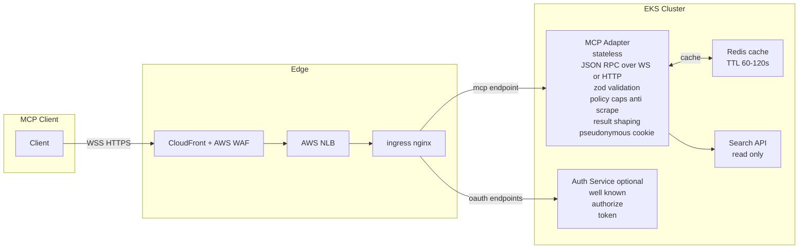

# Components (EKS + CloudFront/WAF + NLB + ingress-nginx)

```mermaid
flowchart LR
  subgraph Client["MCP Client"]
    C["Client"]
  end

  subgraph Edge["Edge"]
    CF["CloudFront + AWS WAF"]
    NLB["AWS NLB"]
    INX["ingress nginx"]
  end

  subgraph Cluster["EKS Cluster"]
    ADP["MCP Adapter\nstateless
         JSON RPC over WS or HTTP
         zod validation
         policy caps anti scrape
         result shaping
         pseudonymous cookie"]
    RDS["Redis cache
         TTL 60-120s"]
    AUTH["Auth Service optional
          well known
          authorize
          token"]
    SRCH["Search API
          read only"]
  end

  C -->|WSS HTTPS| CF --> NLB --> INX
  INX -->|mcp endpoint| ADP
  INX -->|oauth endpoints| AUTH
  ADP <-->|cache| RDS
  ADP --> SRCH
```