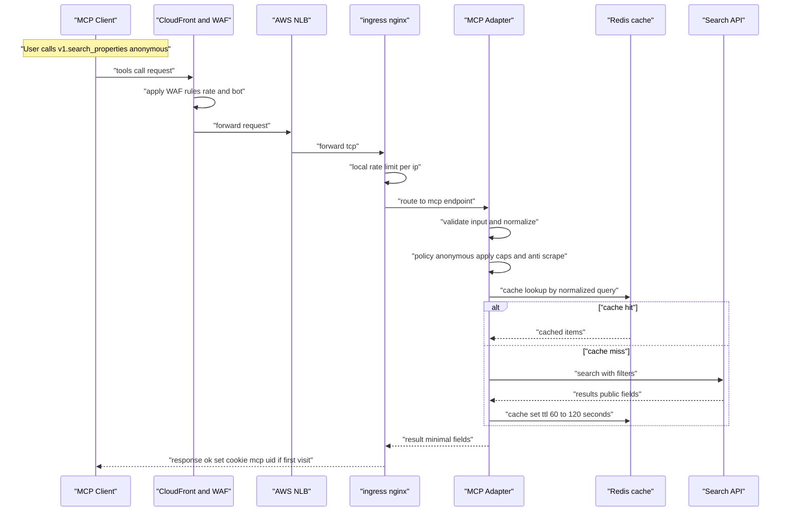
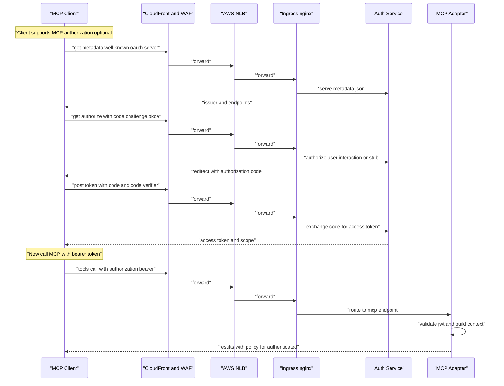
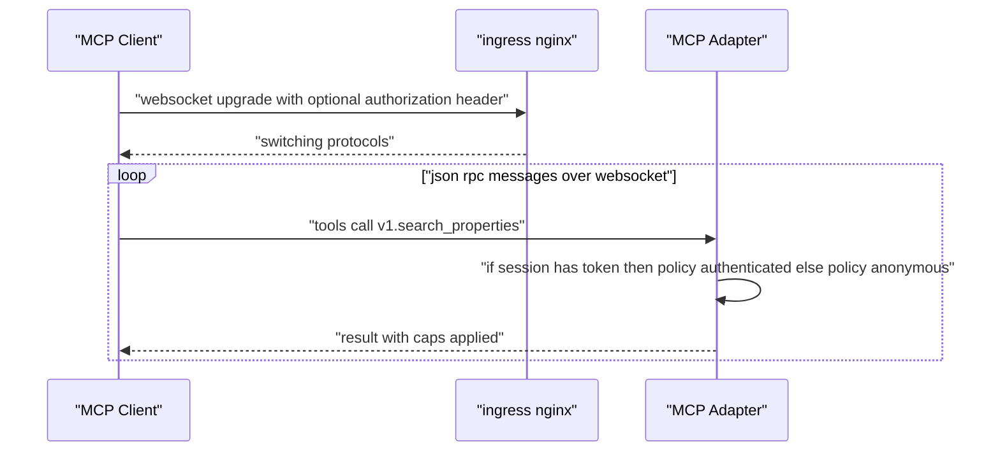
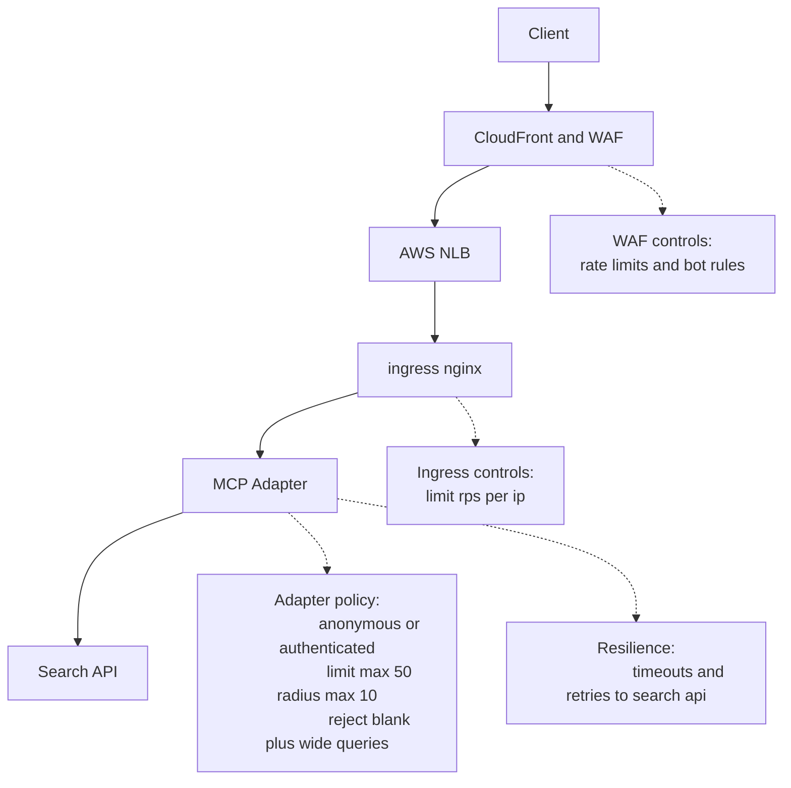

# HTTP MCP (EKS + CloudFront/WAF + NLB + ingress-nginx)

This document outlines a lean, production-friendly MCP server design for a **search-only** tool (`v1.search_properties`) that works **anonymously** today and is **authorization-ready** for later curated, per-user results. It follows the MCP spec’s tools pattern (`tools/list`, `tools/call`), uses JSON-RPC, and supports WebSocket upgrade for low-latency streaming.

---

## Components (EKS + CloudFront/WAF + NLB + ingress-nginx)


**Why this layout**

* **Standards-aligned:** MCP tools over HTTP/WS, discover via `tools/list`, invoke via `tools/call`. JSON-RPC 2.0 is tiny and transport-agnostic.
* **Low-latency:** WebSocket upgrade (RFC 6455) keeps a single, duplex connection for multiple calls and streaming.
* **Edge safety:** CloudFront + AWS WAF provide global rate limits and bot filtering; ingress-nginx gives simple per-IP throttles.

---

## Anonymous search flow



---

## Optional authorization flow (MCP Authorization, OAuth 2.1 + PKCE)



**Spec alignment**
Auth is **optional** for search, but publishing OAuth metadata now lets capable clients self-upgrade later (Authorization Code + PKCE, RFC 8414 discovery).

---

## WebSocket upgrade & per-message policy



**Notes**
WS is ideal when you want multiple tool calls and potential streaming on one persistent connection (RFC 6455). If you only need one-shot calls, plain HTTPS works too.

---

## Error & abuse control decision points



* **Global throttling & bot filtering** at CloudFront + AWS WAF (rate-based rules).
* **Local throttling** at ingress-nginx with `limit-rps` annotations; good enough to deter casual scraping.

---

## Scope & SLOs (Iteration 0)

* Tooling: **`v1.search_properties` only** (read-only).
* p95 latency: **≤ 600 ms** for cached hotspots; **≤ 1.2 s** cold.
* Server caps (enforced regardless of client): **`limit ≤ 50`**, **`radius_km ≤ 10`**, sane price ranges, clamped enums.
* Availability target: **99.9%**.

---

## Tool schema (request/response)

**Request**

```json
{
  "location": "string (area or postcode)",
  "radius_km": 0.1,
  "listing_type": "rent|sale",
  "min_price": 0,
  "max_price": 0,
  "beds": 0,
  "tenure": "freehold|leasehold|any",
  "sort": "newest|price_asc|price_desc|distance",
  "limit": 1,
  "page_token": "opaque"
}
```

**Response (public fields only)**

```json
{
  "items": [
    {
      "id": "prop_123",
      "title": "2-bed flat near Highgate",
      "price": 2100,
      "currency": "GBP",
      "beds": 2,
      "baths": 1,
      "location_label": "Highgate, N6",
      "partial_address": "Jackson Ln area",
      "thumbnail_url": "https://...",
      "listing_type": "rent"
    }
  ],
  "next_page_token": "abc123"
}
```

> MCP clients discover and call tools using `tools/list` and `tools/call`; JSON-RPC 2.0 structures the calls and error mapping.

---

## Edge controls you can turn on now

### CloudFront + AWS WAF (recommended)

* CloudFront **supports WebSockets** to your NLB/ingress.
* Add a **rate-based rule** (e.g., 2000 req/5-min/IP) + **AWS Managed Rules** as needed; understand the evaluation window.

### ingress-nginx (cluster-local)

```yaml
nginx.ingress.kubernetes.io/proxy-read-timeout: "3600"
nginx.ingress.kubernetes.io/proxy-send-timeout: "3600"
nginx.ingress.kubernetes.io/limit-rps: "10"
nginx.ingress.kubernetes.io/limit-burst-multiplier: "5"
nginx.ingress.kubernetes.io/use-forwarded-headers: "true"
```

Use per-IP per-pod limits now; move global enforcement to WAF as traffic grows.

---

## Authorization (Iteration 0.5 “auth-ready”, optional today)

Publish OAuth metadata now so clients can self-upgrade later. Keep anonymous access for search.

**`/.well-known/oauth-authorization-server`**

```json
{
  "issuer": "https://mcp.your-domain.com",
  "authorization_endpoint": "https://mcp.your-domain.com/authorize",
  "token_endpoint": "https://mcp.your-domain.com/token",
  "registration_endpoint": "https://mcp.your-domain.com/register",
  "scopes_supported": ["props:read"],
  "response_types_supported": ["code"],
  "grant_types_supported": ["authorization_code", "client_credentials"],
  "code_challenge_methods_supported": ["S256"],
  "token_endpoint_auth_methods_supported": ["none","client_secret_post"]
}
```

MCP Authorization: OAuth 2.1 + PKCE, with RFC 8414 metadata discovery (auth is optional for tools that don’t require it).

---

## Privacy & data minimisation

* **No PII** in responses: partial addresses only; no emails/phones in anonymous mode.
* Prefer aggregates for area stats; clamp fields to public-safe values.
* Optional **pseudonymous cookie** `mcp_uid` (HttpOnly, Secure, SameSite=None) to store non-PII preferences; document retention (e.g., 90 days).

---

## Rollout plan

1. **Day 1:** Anonymous `v1.search_properties`, ingress-nginx rate limits; optionally put CloudFront in front (WAF as a follow-up).
2. **Week 2:** Attach **AWS WAF** web ACL with a rate-based rule; monitor block counts and evaluation window.
3. **Week 3:** Turn on MCP Authorization (code + PKCE) and lift caps for authenticated sessions.

---

## Testing checklist (PR-ready)

* JSON-RPC conformance (ids, error codes).
* WebSocket upgrade works end-to-end via CloudFront → NLB → ingress.
* WAF rate rule triggers at configured threshold; ingress local limits trigger at `limit-rps`.
* Anonymous policy clamps (`limit ≤ 50`, `radius ≤ 10`) regardless of client ask.
* No PII fields in payloads; addresses are partial.
* SLOs: p95 latency under targets; error rates < 1%.

---

## Appendix: Sources

* **MCP – Overview & Spec (tools, transports, resources, prompts)**

  * [https://modelcontextprotocol.io/](https://modelcontextprotocol.io/)
  * [https://modelcontextprotocol.io/specification/](https://modelcontextprotocol.io/specification/)

* **MCP Authorization (HTTP; OAuth 2.1 + PKCE profile; discovery)**

  * [https://modelcontextprotocol.io/specification/2025-03-26/basic/authorization](https://modelcontextprotocol.io/specification/2025-03-26/basic/authorization)
  * RFC 8414 (OAuth 2.0 Authorization Server Metadata): [https://www.rfc-editor.org/rfc/rfc8414](https://www.rfc-editor.org/rfc/rfc8414)
  * RFC 7636 (PKCE): [https://www.rfc-editor.org/rfc/rfc7636](https://www.rfc-editor.org/rfc/rfc7636)

* **JSON-RPC 2.0**

  * [https://www.jsonrpc.org/specification](https://www.jsonrpc.org/specification)

* **WebSocket protocol**

  * RFC 6455: [https://datatracker.ietf.org/doc/html/rfc6455](https://datatracker.ietf.org/doc/html/rfc6455)

* **AWS CloudFront WebSockets**

  * [https://docs.aws.amazon.com/AmazonCloudFront/latest/DeveloperGuide/websockets.html](https://docs.aws.amazon.com/AmazonCloudFront/latest/DeveloperGuide/websockets.html)

* **AWS WAF rate-based rules & managed protections**

  * Rate-based rules: [https://docs.aws.amazon.com/waf/latest/developerguide/waf-rule-statement-type-rate-based.html](https://docs.aws.amazon.com/waf/latest/developerguide/waf-rule-statement-type-rate-based.html)
  * AWS Managed Rules overview: [https://docs.aws.amazon.com/waf/latest/developerguide/aws-managed-rule-groups-list.html](https://docs.aws.amazon.com/waf/latest/developerguide/aws-managed-rule-groups-list.html)

* **ingress-nginx rate limiting**

  * Annotations (rate limiting): [https://kubernetes.github.io/ingress-nginx/user-guide/nginx-configuration/annotations/#rate-limiting](https://kubernetes.github.io/ingress-nginx/user-guide/nginx-configuration/annotations/#rate-limiting)

* **GitHub Mermaid diagrams**

  * [https://docs.github.com/get-started/writing-on-github/working-with-advanced-formatting/creating-diagrams](https://docs.github.com/get-started/writing-on-github/working-with-advanced-formatting/creating-diagrams)

---

## Optional extras

* **OAuth 2.0 (core)**: RFC 6749 [https://www.rfc-editor.org/rfc/rfc6749](https://www.rfc-editor.org/rfc/rfc6749)
* **OAuth 2.0 Bearer Token**: RFC 6750 [https://www.rfc-editor.org/rfc/rfc6750](https://www.rfc-editor.org/rfc/rfc6750)
* **OpenID Connect Discovery** (useful if you adopt OIDC for user auth): [https://openid.net/specs/openid-connect-discovery-1_0.html](https://openid.net/specs/openid-connect-discovery-1_0.html)
